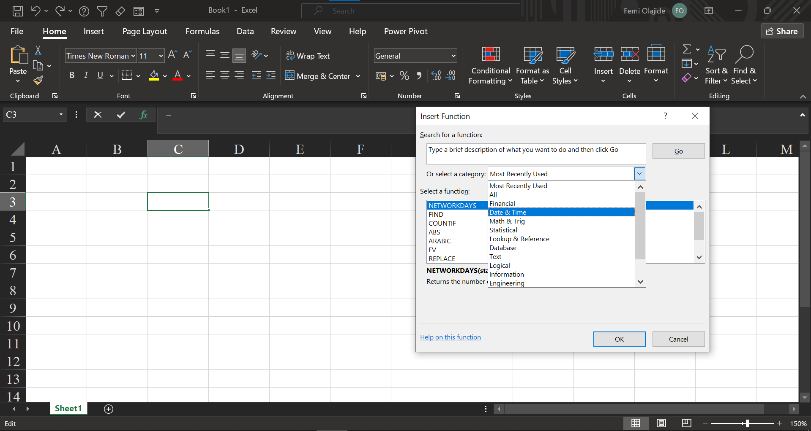

# 📈 **Excel Functions in Python**

This project is about recreating some common Excel functions in Python. The idea is simple: many people are used to working in Excel, but Python is more powerful for larger projects.  So I decided to show how Excel-style functions can be written and used in Python.

---
## 📑 **Table of Contents**
1. [INTRODUCTION](#-excel-functions-in-python)  
2. [MATH & STATS FUNCTION](#-math-and-stats-functions)
    - [Sum](#-sum)

## 🔹 **Why I Built This**
- To practice and show my coding skills in Python.  
- To make it easier for people who already know Excel to see how things translate into Python.  
- To create a starting point for a bigger portfolio where I’ll keep adding useful functions and projects.  

---

## 🔹 **What’s Inside**
The functions are grouped into:
### 🧮 **Math and Stats Functions**
###  **SUM**
---

- **Description:**  
    - Implemented as `excel_sum(*numbers)` in Python.  
    - Replicates Excel’s `=SUM()` behaviour:  
        - Accepts lists, tuples, Series, or DataFrames as ranges.  
        - Ignores logical values (`TRUE` / `FALSE`) and text inside ranges, just like Excel.  
        - Raises `TypeError` for invalid inputs (similar to Excel’s `#NAME?` error).  
        - Can handle more than 255 arguments, unlike Excel’s limit.  

- **How Excel Shows It:**  
This is how Excel presents the SUM function in its *Function Arguments* window:  

**Source Code:**  
Click [here](excel_math_function.py#L1-L88) to view the sourse code

**View Notebook Demo:**  

Click [here](https://github.com/Femiolajide/Excel-Fuctions-in-Python/blob/main/demo_notebook.ipynb) to view the notebook demo

**Run Notebook Demo:**  
Click [here](https://mybinder.org/v2/gh/Femiolajide/Excel-Fuctions-in-Python/HEAD?filepath=demo_notebook.ipynb
) to **run** the usage example in the demo notebook
